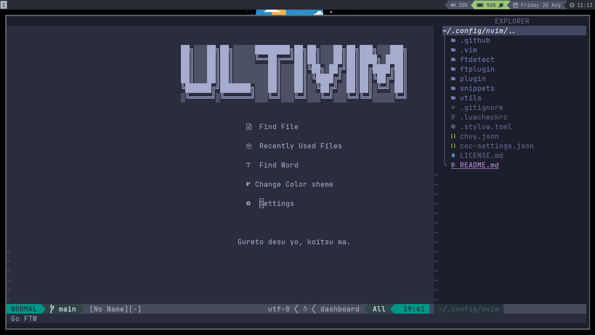
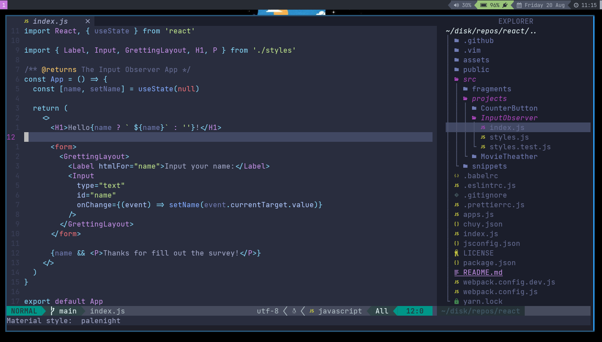

# My NeoVim Configuration

My Neovim setup, highly documented to serve as a guide.

## Index

- [About](#About)
- [Mappings](#Mappings)
- [Structure](#Structure)
- [Media](#Media)

## About

### Mappings

Leader key: <kbd>space</kbd>

For the definitions refer to [`plugin/mappings.lua`](./plugin/mappings.lua).

### Structure

```markdown
$HOME/.config/nvim
├── plugin: General Configuration
│ ├── mappings.lua
│ ├── telescope.lua
│ ├── lualine.lua
│ └── etc
├── snippets: snippets in json
│ ├── javascript.json
│ └── etc
├── utils: Some Utils
│ ├── assets/
│ ├── old-plugins-configuration/
│ └── etc
├── ftdetect: Detect filetype not natively supported on Vim
│ ├── stylus.lua
│ ├── zig.lua
│ └── etc
├── ftplugin: Per filetype configuration
│ ├── python.lua
│ ├── javascript.lua
│ ├── ruby.lua
│ └── etc
└── coc-settings.json: Coc Config
```

### Media




See all screenshots on [`utils/assets/`](./utils/assets).

### License

MIT © [UltiRequiem](https://github.com/UltiRequiem).
